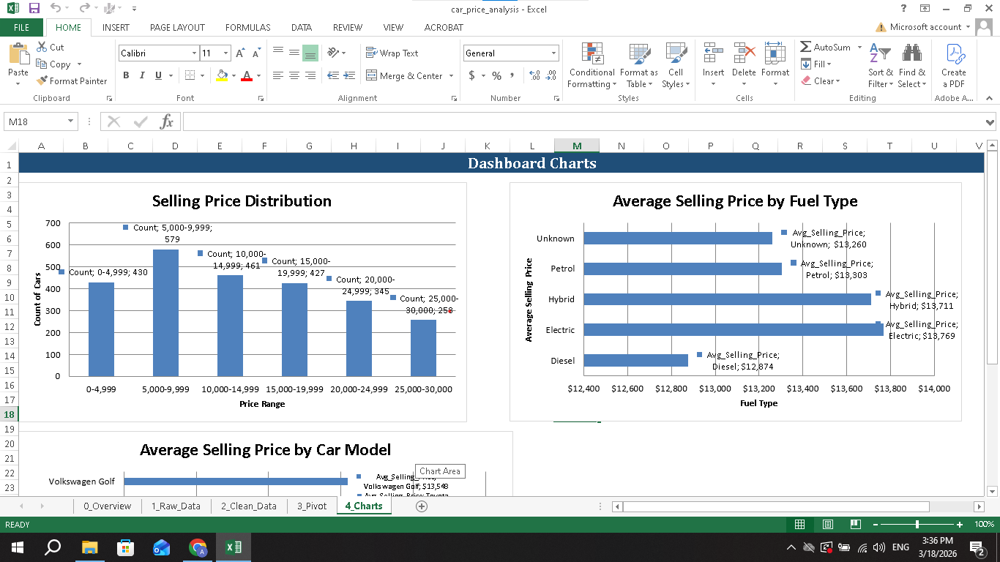

# Car Price Analysis and Data Cleaning Project

This project focuses on cleaning and analyzing a car sales dataset using Microsoft Excel.

## Project Overview
The goal of this project was to transform messy data into a clean and structured dataset and extract meaningful insights.

## Data Cleaning
- Handled missing values  
- Removed duplicate records  
- Standardized categorical values  
- Converted data types  
- Identified and handled outliers  

## Analysis
- Selling price distribution (Histogram)  
- Average selling price by fuel type (Pivot Table)  
- Average selling price by transmission  
- Price difference calculation  

## Key Insights
- Vehicles depreciate over time  
- Fuel type influences resale value  
- Transmission affects selling price  
- Most cars fall into a mid-range price category  

## Tools Used
- Microsoft Excel  
- Data Cleaning Techniques  
- Pivot Tables and Charts  

## Project File
- `car_price_analysis.xlsx` → contains raw data, cleaned data, pivot tables, and charts
## Project Screenshots

### Average Selling Price by Fuel Type

### Clean Data Preview

